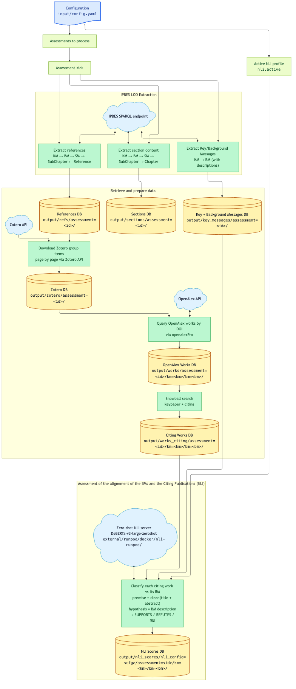
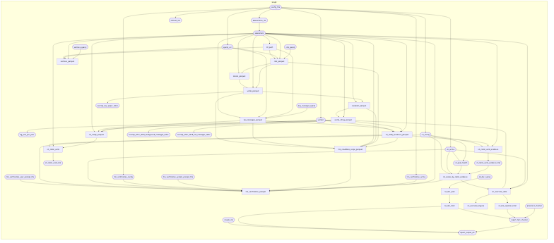

# targets Pipeline Documentation

This document describes the `targets` pipeline for the IPBES BM Fact Checker project.

**Note: this document predates the reporting/explorer layer and is stale in
that respect** — it does not describe the `nli_ready_evidence_parquet` →
`nli_claim_units_evidence` → `nli_scores_by_claim_evidence` chain, or the
downstream `nli_overview_data`, `nli_overview_figures`, `nli_bm_explorer_html`,
`td_doc_html`, and `report_fact_checker` targets, all of which exist and run
today. See `_targets.R` and [CLAUDE.md](CLAUDE.md)'s R-files table for the
current, authoritative target list.

## Overview

The pipeline fetches IPBES assessment data from the [IPBES Linked Open Data (LOD)](https://github.com/IPBES-Data/IPBES_LOD) repository in RDF/Turtle format, queries the assessments via SPARQL, and produces per-assessment Parquet datasets for refs, sections, key-messages, Zotero items, OpenAlex works, snowball results, and NLI alignment scores.

The **active scoring approach** is NLI (`nli_scores_by_claim` / `nli_scores_by_claim_evidence`): each citing work is classified as SUPPORTS / REFUTES / NOT_ENOUGH_INFO against its partition's Background Message using a zero-shot DeBERTa NLI model served on RunPod (see [docker/nli-runpod/](docker/nli-runpod/) and [TD_BM_NLI_approach.md](TD_BM_NLI_approach.md)).

The **parked LLM-comparison approach** (`prompts_truth_parquet` → `prompts_citing_parquet` → `alignement_scores_parquet`) is not wired into `_targets.R` but its source files remain on disk.

Fuseki startup and shutdown are handled inside the parquet builders rather than as separate targets. When `sparql_url: fuseki`, each builder boots an in-memory Fuseki, POSTs the TTL into the named graph `http://ontology.ipbes.net/report/<id>` via the Graph Store Protocol, runs its query, and tears Fuseki down.

## Running the Pipeline

```r
# Run all outdated targets
targets::tar_make()

# Visualise the dependency graph
targets::tar_visnetwork()

# Check which targets are outdated
targets::tar_outdated()

# Load a target into your session
targets::tar_load(refs_parquet)
```

## Pipeline Diagrams

### Rendered Workflow (NLI approach)



### Pipeline

Auto-generated pipeline flow based on `_targets.R` definition:



## Pipeline DAG

```
config_file (file)
    ├── sparql_url                              ← SPARQL backend string
    ├── nli_active                              ← active NLI profile name
    ├── nli_config                              ← resolved NLI profile (host, model, etc.)
    ├── assessments_list
    │       └── assessment (list, branched)
    │               ├── ttl_path (file)                    ← Target 1
    │               ├── refs_sparql (file) ──────────────── queries/refs.sparql
    │               ├── refs_parquet (file)                ← Target 2a
    │               ├── sections_sparql (file) ──────────── queries/sections.sparql
    │               ├── sections_parquet (file)            ← Target 2b
    │               ├── key_messages_sparql (file) ──────── queries/key_messages.sparql
    │               ├── key_messages_parquet (file)        ← Target 2b2
    │               ├── zotero_parquet (file)              ← Target 2c
    │               ├── works_parquet (file)               ← Target 2d
    │               ├── snowball_parquet (file)            ← Target 2e
    │               └── works_citing_parquet (file)        ← Target 2f
    └── nli_config ─────────────────────────────────────────┐
        assessment ─────────────────────────────────────────┤
        key_messages_parquet ───────────────────────────────┤→ nli_scores_parquet ← Target 2g
        works_citing_parquet ───────────────────────────────┘
```

**PARKED — LLM-comparison chain** (targets commented out in `_targets.R`):

```
# prompts_truth_parquet  ← Target 2h (parked)
# prompts_citing_parquet ← Target 2i (parked)
# alignement_scores_parquet ← Target 3 (parked)
```

## Configuration (`input/config.yaml`)

```yaml
sparql_url: fuseki

assessments:
  - id: GA1
    ttl_url: https://...
  - id: IAS
    ttl_url: https://...

nli:
  active: deberta_zeroshot   # which entry under configs: is active

  configs:
    deberta_zeroshot:
      scheme: https
      host: <pod-id>-8080.proxy.runpod.net
      port: null
      model: MoritzLaurer/deberta-v3-large-zeroshot-v2.0
      candidate_labels: ["supports", "refutes", "is not relevant to"]
      hypothesis_template: "This paper {} the following claim: %s"
      batch_size: 128
      uncertain_threshold: 0.60
      nei_threshold: 0.90
```

Config is split into fine-grained targets — each reads only its own section from
`config_file` directly (no intermediate `config` target). Changing one section
re-runs only that target; if the extracted value is unchanged, nothing downstream
cascades.

| Config key | Target | Invalidates |
|---|---|---|
| `sparql_url` | `sparql_url` | All SPARQL build targets |
| `assessments` | `assessments_list` → `assessment` | Assessment branches and their outputs |
| `nli.active` | `nli_active` → `nli_config` | `nli_scores_parquet` only |
| `nli.configs.<active>.*` | `nli_config` | `nli_scores_parquet` only |

## Target 0: `assessment` — Assessment Specs

**Source:** `_targets.R`

Creates a named list of assessment specifications from `assessments_list`. Each element gains an `index` field used for deterministic Fuseki port assignment. Branch names are the assessment IDs — adding a new assessment creates a new branch without invalidating existing ones.

## Target 1: `ttl_path` — Download TTL File

**Source:** `R/download_ttls.R` → `download_ttl(assessment)`

For each assessment branch:
1. Creates `output/LoD/` if it does not exist.
2. Queries the GitHub Contents API for the current SHA of the remote TTL file.
3. Skips the download if a local copy with a matching SHA already exists.
4. Otherwise downloads to `output/LoD/<id>.ttl` and writes the SHA next to it.

Returns a character vector of local TTL file paths (`format = "file"`).

> Even when `sparql_url` is a remote URL, TTL files are still downloaded as a declared pipeline dependency. The download is cheap once cached.

## Target 2a: `refs_parquet` — DB1

**Source:** `R/write_refs_parquet.R` → `build_refs_parquet(sparql_url, assessment, ttl_path, refs_sparql, "output/refs")`

Builds the refs dataset for one assessment branch and writes to `output/refs/assessment=<id>/`. When `sparql_url: fuseki`, starts a local Fuseki session, POSTs the TTL into the named graph, runs the SPARQL query, and stops Fuseki on exit.

### Reading DB1

```r
arrow::open_dataset("output/refs") |>
  dplyr::filter(assessment == "GA1", km == "A.", bm == "A1") |>
  dplyr::collect()
```

### Schema — DB1

| Column | Type | Description |
|---|---|---|
| `assessment` | chr | Assessment ID (partition) |
| `km` | chr | Key Message identifier |
| `bm` | chr | Background Message identifier |
| `sm` | chr | Sub-Message identifier |
| `doi` | chr | DOI string — `NA` if absent |
| `description` | chr | Citation text from the LOD |
| `citation` | chr | Zotero-key citation string like `[P62TQUG2]` |
| `zotero_group` | chr | Zotero group id |
| `zotero_key` | chr | Raw Zotero item key |
| `zotero` | chr | Zotero URL (`owl:sameAs`) |

## Target 2b: `sections_parquet` — DB2

**Source:** `R/write_sections_parquet.R` → `build_sections_parquet(sparql_url, assessment, ttl_path, sections_sparql, "output/sections")`

Builds the sections dataset for one assessment branch. Each SubChapter source row carries the SubMessage that referenced it (`sm` column). Written to `output/sections/assessment=<id>/`.

### Reading DB2

```r
arrow::open_dataset("output/sections") |>
  dplyr::filter(assessment == "GA1", km == "A.", bm == "A1") |>
  dplyr::collect()
```

### Schema — DB2

| Column | Type | Description |
|---|---|---|
| `assessment` | chr | Assessment ID (partition) |
| `km` | chr | Key Message identifier |
| `bm` | chr | Background Message identifier |
| `sm` | chr | Sub-Message identifier |
| `section` | chr | Chapter identifier |
| `subsection` | chr | SubChapter identifier |
| `content` | chr | SubChapter description text |

## Target 2b2: `key_messages_parquet` — DB3

**Source:** `R/write_key_messages_parquet.R` → `build_key_messages_parquet(sparql_url, assessment, ttl_path, key_messages_sparql, "output/key_messages")`

Builds the key/background/sub-messages dataset for one assessment branch. Written to `output/key_messages/assessment=<id>/`.

### Reading DB3

```r
arrow::open_dataset("output/key_messages") |>
  dplyr::filter(assessment == "GA1", km == "A.", bm == "A1") |>
  dplyr::collect()
```

### Schema — DB3

| Column | Type | Description |
|---|---|---|
| `assessment` | chr | Assessment ID (partition) |
| `km` | chr | Key Message identifier |
| `km_label` | chr | KM headline text |
| `km_description` | chr | KM detail text |
| `bm` | chr | Background Message identifier |
| `bm_label` | chr | BM headline text |
| `bm_description` | chr | BM detail text — used as NLI hypothesis |
| `bm_well_established` | chr | BM confidence flag |
| `bm_established_incomplete` | chr | BM confidence flag |
| `sm_id` | chr | Sub-Message identifier |
| `sm_description` | chr | SM statement text |
| `sm_well_established` | chr | SM confidence flag |
| `sm_established_incomplete` | chr | SM confidence flag |

## Target 2c: `zotero_parquet` — Zotero Group Items

**Source:** `R/download_zotero.R` → `download_zotero(assessment, refs_parquet)`

Reads the refs branch for one assessment, infers the Zotero group id from the `zotero` column, downloads all top-level Zotero items page by page, and writes to `output/zotero/assessment=<id>/` partitioned by `group_id` and `page`.

## Target 2d: `works_parquet` — OpenAlex Works

**Source:** `R/download_works.R` → `download_works(assessment, zotero_parquet, refs_parquet, workers = 8)`

Reads DOIs from the Zotero branch, fetches OpenAlex works with `openalexPro::pro_fetch()`, then joins with `refs_parquet` on normalised DOI to attach `km` and `bm` columns. Written to `output/works/assessment=<id>/` partitioned by `assessment`, `km`, and `bm`.

### Reading DB4

```r
arrow::open_dataset("output/works") |>
  dplyr::filter(assessment == "GA1", km == "A.", bm == "A1") |>
  dplyr::select(id, doi, title) |>
  dplyr::collect()
```

### Schema — DB4 (selected columns)

| Column | Type | Description |
|---|---|---|
| `assessment` | chr | Assessment ID (partition) |
| `km` | chr | Key Message identifier (partition) |
| `bm` | chr | Background Message identifier (partition) |
| `id` | chr | OpenAlex work ID URL |
| `doi` | chr | DOI string |
| `title` | chr | Work title |
| `publication_year` | int | Year of publication |
| … | … | 51 OpenAlex columns total |

## Target 2e: `snowball_parquet` — Snowball Search

**Source:** `R/build_snowball_parquet.R` → `build_snowball_parquet(assessment, works_parquet, "output/snowball")`

For each assessment branch, iterates over all km/bm combinations in `works_parquet` and calls `openalexSnowball::pro_snowball()` to retrieve all papers that cite or are cited by the seeds. Writes to three shared parquet roots:

- `output/snowball/nodes/` — partitioned by `assessment`, `km`, `bm`, `relation`
- `output/snowball/edges/` — partitioned by `assessment`, `km`, `bm`, `edge_type`
- `output/snowball/keypaper/` — partitioned by `assessment`, `km`, `bm`

### Reading

```r
arrow::open_dataset("output/snowball/nodes") |>
  dplyr::filter(assessment == "GA1", km == "A.", bm == "A1") |>
  dplyr::select(id, doi, title, relation) |>
  dplyr::collect()
```

### Schema — Nodes

| Column | Type | Description |
|---|---|---|
| `assessment` | chr | Assessment ID (partition) |
| `km` | chr | Key Message identifier (partition) |
| `bm` | chr | Background Message identifier (partition) |
| `relation` | chr | `"keypaper"`, `"citing"`, or `"cited"` (partition) |
| `oa_input` | lgl | `TRUE` if this work was a seed |
| `id` | chr | OpenAlex work ID URL |
| `doi` | chr | DOI string |
| `title` | chr | Work title |
| `publication_year` | int | Year of publication |
| … | … | 53 columns total |

### Schema — Edges

| Column | Type | Description |
|---|---|---|
| `assessment` | chr | Assessment ID (partition) |
| `km` | chr | Key Message identifier (partition) |
| `bm` | chr | Background Message identifier (partition) |
| `edge_type` | chr | `"core"`, `"extended"`, or `"outside"` (partition) |
| `from` | chr | OpenAlex ID of citing work |
| `to` | chr | OpenAlex ID of cited work |

## Target 2f: `works_citing_parquet` — Citing Works

**Source:** `R/build_works_citing_parquet.R` → `build_works_citing_parquet(assessment, snowball_parquet, "output/works_citing")`

Copies snowball nodes with `relation == "citing"` into `output/works_citing/assessment=<id>/km=<km>/bm=<bm>/`. File-copy approach is required because OpenAlex's nested struct columns can have inconsistent schemas across km/bm partitions.

### Reading

```r
arrow::open_dataset("output/works_citing") |>
  dplyr::filter(assessment == "GA1", km == "A.", bm == "A1") |>
  dplyr::select(id, doi, title, publication_year) |>
  dplyr::collect()
```

### Schema

Same columns as snowball nodes minus `relation` (always `citing` in this dataset).

## Target 2g: `nli_scores_parquet` — NLI Alignment Scores

**Source:** `R/build_nli_scores_parquet.R` → `build_nli_scores_parquet(assessment, key_messages_parquet, works_citing_parquet, nli_config, nli_active, "output/nli_scores")`

For each `(assessment, km, bm)` partition in `works_citing_parquet`:

1. Reads the BM description from `key_messages_parquet` as the NLI hypothesis.
2. Cleans each citing work's `title + abstract` as the premise.
3. POSTs batches to the zero-shot NLI server (see [docker/nli-runpod/](docker/nli-runpod/)).
4. Stores the full probability distribution (`p_supports`, `p_refutes`, `p_nei`) plus predicted label and confidence.

Output is written to `output/nli_scores/nli_config=<cfg>/assessment=<id>/km=<km>/bm=<bm>/`, partitioned by `nli_config` so scores from different model profiles are stored separately and comparable.

See [TD_BM_NLI_approach.md](TD_BM_NLI_approach.md) for full design rationale.

### Reading

```r
arrow::open_dataset("output/nli_scores") |>
  dplyr::filter(nli_config == "deberta_zeroshot", assessment == "GA1", bm == "A1") |>
  dplyr::collect()
```

### Schema

| Column | Type | Description |
|---|---|---|
| `nli_config` | chr | Active NLI profile name (partition) |
| `assessment` | chr | Assessment ID (partition) |
| `km` | chr | Key Message identifier (partition) |
| `bm` | chr | Background Message identifier (partition) |
| `work_id` | chr | OpenAlex work ID URL |
| `doi` | chr | DOI string |
| `title` | chr | Paper title |
| `publication_year` | int | Publication year |
| `label` | chr | Predicted label: `SUPPORTS`, `REFUTES`, or `NOT_ENOUGH_INFO` |
| `p_supports` | dbl | Model probability for SUPPORTS |
| `p_refutes` | dbl | Model probability for REFUTES |
| `p_nei` | dbl | Model probability for NOT_ENOUGH_INFO |
| `confidence` | dbl | `max(p_supports, p_refutes, p_nei)` |
| `uncertain` | lgl | `TRUE` if `confidence < uncertain_threshold` |

## PARKED — LLM-comparison chain

The following targets are **commented out** in `_targets.R`. Source files remain on
disk to allow un-parking. See [TD_LLM_approach.md](TD_LLM_approach.md) for design
and [TD_NLI_LLM_two_phase.md](TD_NLI_LLM_two_phase.md) for the planned two-phase
extension.

### Target 2h: `prompts_truth_parquet` *(parked)*

**Source:** `R/build_prompts_truth_parquet.R`

Structured JSON truth document per `(assessment, KM, BM)` combining BM metadata,
SubMessages, and source passages. Written to `output/prompts/truth/assessment=<id>/`.

### Target 2i: `prompts_citing_parquet` *(parked)*

**Source:** `R/build_prompts_citing_parquet.R`

Structured JSON candidate prompt per citing work. Written to
`output/prompts/citing/assessment=<id>/km=<km>/bm=<bm>/`.

### Target 3: `alignement_scores_parquet` *(parked)*

**Source:** `R/build_alignement_scores_parquet.R`

Per run in `analysis.runs[]`, scores citing prompts against the matching truth prompt
via OpenRouter / ellmer. Output schema: `work_alignement` (−5 to +5), `confidence`,
`evidence`, `justification`. Written to
`output/alignement_scores/assessment=<id>/run_id=<id>/km=<km>/bm=<bm>/model=<model>/replicate=<n>/`.

---

## SPARQL Queries

All three SPARQL queries live in `queries/*.sparql` and are tracked as `format = "file"` targets. Changing a query file invalidates only the downstream parquet target.

| File | Target | Traversal |
|---|---|---|
| `queries/refs.sparql` | `refs_parquet` | `KM → BM → SM → SubChapter ← Reference(doi)` |
| `queries/sections.sparql` | `sections_parquet` | `KM → BM → SM → SubChapter(content) → Chapter` (projects `sm_id`) |
| `queries/key_messages.sparql` | `key_messages_parquet` | `KM → BM → SM` (text + confidence flags) |

All three queries wrap their pattern in `GRAPH <%GRAPH_IRI%> { ... }`. The placeholder
is substituted at query time by `read_sparql_query()` using `assessment_graph_iri()`
from `R/branch_helpers.R` — currently `http://ontology.ipbes.net/report/<id>`.
Switching backends is a one-line change in `input/config.yaml` (`sparql_url:`).

## Orphaned / Deprecated Source Files

Not wired into the current `_targets.R`; kept for reference:

- `R/build_fulltext.R` — legacy Grobid XML / PDF download for citing works
- `R/resolve_citations.R` — replace `(Author, Year)` with OpenAlex W-IDs in section content
- `R/build_alignement_parquet.R` — legacy single-pass LLM scoring; superseded by `build_alignement_scores_parquet.R`

## Notes

- All parquet targets are assessment-branched; there is no cached combined object.
- Each assessment branch rewrites only its own partition directory.
- Credentials (`API_openalex`, `API_openrouter`) are read from the macOS keyring by `_targets.R` at session start via `keyring::key_get()`.

## Required R Packages

| Package | Role |
|---|---|
| `targets` | Pipeline engine |
| `yaml` | Config parsing |
| `keyring` | API credential retrieval |
| `processx` | Fuseki subprocess management |
| `httr2` | HTTP SPARQL queries, Graph Store Protocol POSTs, NLI server requests |
| `readr` | CSV response parsing |
| `arrow` | Parquet I/O |
| `dplyr` | Data manipulation |
| `tictoc` | Query timing |
| `jsonlite` | JSON serialisation for prompts |
| `xml2`, `stringr` | Text cleaning (`clean_text.R`) |
| `ellmer` | OpenRouter chat client (parked LLM chain) |
| `openalexPro` | OpenAlex works download |
| `openalexSnowball` | Snowball search |
| `future`, `future.apply` | Parallel workers |

**System dependency:** `fuseki-server` on `PATH` (install with `brew install fuseki`). Only required when `sparql_url: fuseki`.
