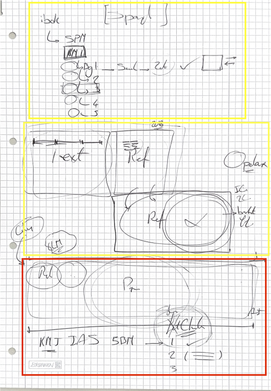
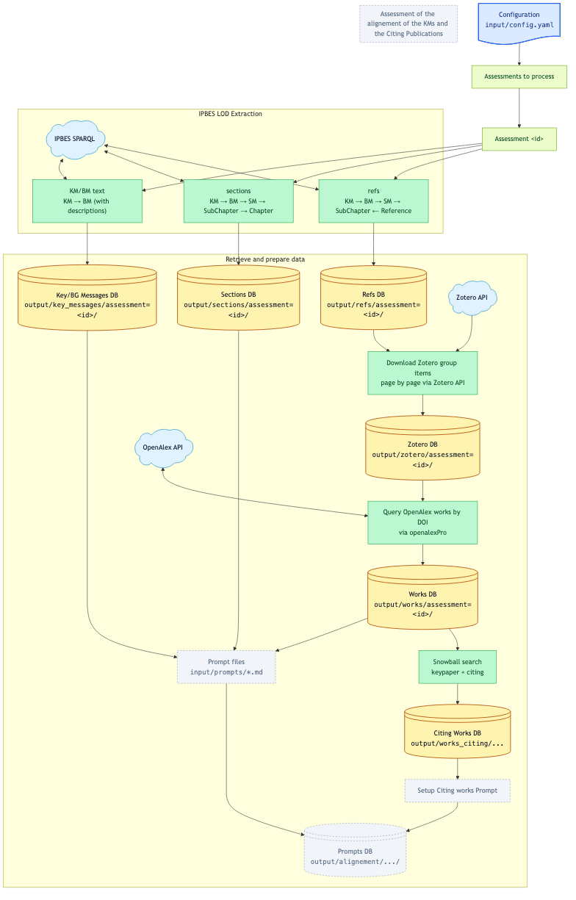
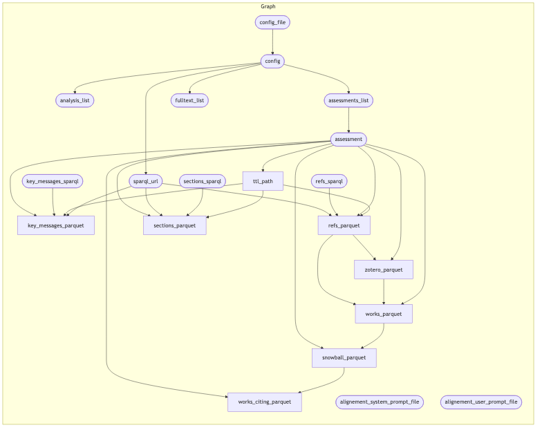

# targets Pipeline Documentation

This document describes the `targets` pipeline for the IPBES Knowledge Discovery project.

## Overview

The pipeline fetches IPBES assessment data from the [IPBES Linked Open Data (LOD)](https://github.com/IPBES-Data/IPBES_LOD) repository in RDF/Turtle format, queries the assessments via SPARQL when needed, and stores refs, sections, Zotero items, and OpenAlex works as separate assessment-branched Parquet datasets.
Fuseki startup and shutdown are handled inside the parquet builders rather than as separate targets.

## Running the Pipeline

```r
# Run all outdated targets
targets::tar_make()

# Visualise the dependency graph
targets::tar_visnetwork()

# Check which targets are outdated
targets::tar_outdated()

# Load a target into your session
targets::tar_load(refs_parquet)
```

## Pipeline Diagrams

### Initial hand-drawn layout. 
The yellow squares are implemented, the red one still needs to be implemented:



### Rendered Workflow

Based on the targets pipeline :



### Pipeline

Auto generated pipeline flow based on `_targets.R` definition



## Pipeline DAG

```
config_file (file)
    └── config
            └── assessment (list)
                    ├── ttl_path (file)                    ← Target 1: download TTL per assessment
                    ├── refs_parquet (file)                ← Target 2a: refs dataset per assessment
                    ├── sections_parquet (file)            ← Target 2b: sections dataset per assessment
                    ├── key_messages_parquet (file)        ← Target 2b2: KM/BM text per assessment
                    ├── zotero_parquet (file)              ← Target 2c: Zotero dataset per assessment
                    ├── works_parquet (file)               ← Target 2d: OpenAlex works per assessment
                    └── resolved_sections_parquet (file)   ← Target 3: citations resolved to W-IDs
```

## Configuration (`input/config.yaml`)

```yaml
# SPARQL endpoint to use for queries.
# "fuseki" = start a local Fuseki server automatically (requires: brew install fuseki).
# Any URL = query that endpoint directly (e.g. a remote SPARQL endpoint).
sparql_url: fuseki

assessments:
  - id: GA1
    ttl_url: https://raw.githubusercontent.com/IPBES-Data/IPBES_LOD/main/Global%20Assessment%201/GA1_v09.ttl
```

Editing this file invalidates `config` and all downstream targets, triggering a full re-run.

## Target 0: `assessment` — Assessment Specs

**Source:** `input/config.yaml` via `_targets.R`

Creates a named list of assessment specifications from `config$assessments`. The branch names are the assessment IDs, so adding a new assessment creates a new branch without invalidating existing ones.

## Target 1: `ttl_path` — Download TTL File

**Source:** `R/download_ttls.R` → `download_ttl(assessment)`

For each assessment branch:
1. Creates `output/LoD/` if it does not exist.
2. Downloads the TTL file to `output/LoD/<id>.ttl` using `utils::download.file()`.
3. Skips the download if the file already exists.

Returns a character vector of local TTL file paths (`format = "file"`).

> Even when `sparql_url` is a remote URL, the TTL files are still downloaded because they are a declared pipeline dependency.

## Target 2a: `refs_parquet` — DB1

**Source:** `R/write_refs_parquet.R` → `build_refs_parquet(config, assessment, ttl_path, "output/refs")`

Builds the refs dataset for one assessment branch, queries only the refs SPARQL, and writes directly to `output/refs/assessment=<id>/`.
When `sparql_url: fuseki`, the function starts a local Fuseki session for the duration of the branch and stops it on exit.

The branch directory is deleted before the write so only that assessment partition is recreated cleanly.

### Reading DB1

```r
library(arrow)
library(dplyr)

arrow::open_dataset("output/refs") |>
  dplyr::filter(assessment == "GA1", km == "A.", bm == "A1") |>
  dplyr::collect()
```

### Schema — DB1

| Column | Type | Description |
|--------|------|-------------|
| `assessment` | chr | Assessment ID (partition) — e.g. `"GA1"` |
| `km` | chr | Key Message identifier — e.g. `"A."` |
| `bm` | chr | Background Message identifier — e.g. `"A1"` |
| `sm` | chr | Sub-Message identifier |
| `doi` | chr | DOI string — `NA` if absent |
| `description` | chr | Citation text from the LOD — `NA` if absent |
| `citation` | chr | Zotero-key citation string like `[P62TQUG2]` |
| `zotero_group` | chr | Zotero group id extracted from `zotero` |
| `zotero_key` | chr | Raw Zotero item key extracted from `zotero` |
| `zotero` | chr | Zotero URL (`owl:sameAs`) — `NA` if absent |

## Target 2b: `sections_parquet` — DB2

**Source:** `R/write_sections_parquet.R` → `build_sections_parquet(config, assessment, ttl_path, "output/sections")`

Builds the sections dataset for one assessment branch, queries only the section-content SPARQL, and writes directly to `output/sections/assessment=<id>/`.
When `sparql_url: fuseki`, the function starts a local Fuseki session for the duration of the branch and stops it on exit.

The branch directory is deleted before the write so only that assessment partition is recreated cleanly.

### Reading DB2

```r
library(arrow)
library(dplyr)

arrow::open_dataset("output/sections") |>
  dplyr::filter(assessment == "GA1", km == "A.", bm == "A1") |>
  dplyr::collect()
```

### Schema — DB2

| Column | Type | Description |
|--------|------|-------------|
| `assessment` | chr | Assessment ID (partition) — e.g. `"GA1"` |
| `km` | chr | Key Message identifier — e.g. `"A."` |
| `bm` | chr | Background Message identifier — e.g. `"A1"` |
| `section` | chr | Chapter identifier — `NA` if not linked |
| `subsection` | chr | SubChapter identifier |
| `content` | chr | SubChapter description text — `NA` if absent |

## Target 2b2: `key_messages_parquet` — DB3

**Source:** `R/write_key_messages_parquet.R` → `build_key_messages_parquet(config, assessment, ttl_path, "output/key_messages")`

Builds the key/background messages dataset for one assessment branch, queries only the KM/BM SPARQL, and writes directly to `output/key_messages/assessment=<id>/`.
When `sparql_url: fuseki`, the function starts a local Fuseki session (port base 5030) for the duration of the branch and stops it on exit.

The branch directory is deleted before the write so only that assessment partition is recreated cleanly.

### Reading DB3

```r
library(arrow)
library(dplyr)

arrow::open_dataset("output/key_messages") |>
  dplyr::filter(assessment == "GA1", km == "A.") |>
  dplyr::collect()
```

### Schema — DB3

| Column | Type | Description |
|--------|------|-------------|
| `assessment` | chr | Assessment ID (partition) — e.g. `"GA1"` |
| `km` | chr | Key Message identifier — e.g. `"A."` |
| `km_description` | chr | KM headline text (`skos:prefLabel`) — `NA` if absent |
| `bm` | chr | Background Message identifier — e.g. `"A1"` |
| `bm_description` | chr | BM headline text (`skos:prefLabel`) — `NA` if absent |
| `bm_details` | chr | BM supporting detail text (`ipbes:hasDescription`) — `NA` if absent |

## Target 2c: `zotero_parquet` — Zotero Group Items

**Source:** `R/download_zotero.R` → `download_zotero(assessment, refs_parquet)`

Reads the refs branch for one assessment, infers the Zotero group id from `zotero`, downloads all top-level Zotero items page by page, and writes a parquet dataset to `output/zotero/assessment=<id>/` partitioned by `group_id` and `page`.

## Target 2d: `works_parquet` — OpenAlex Works

**Source:** `R/download_openalex.R` → `download_works(assessment, refs_parquet)`

Reads the refs branch for one assessment, dedupes DOI values, builds OpenAlex work queries with `openalexPro::pro_query()`, downloads JSON with `openalexPro::pro_request()`, converts to JSONL with `openalexPro::pro_request_jsonl()`, and converts to parquet with `openalexPro::pro_request_jsonl_parquet()`. The output is written to `output/works/assessment=<id>/` as a parquet dataset partitioned by assessment.

## Target 3: `resolved_sections_parquet` — Resolved Sections

**Source:** `R/resolve_citations.R` → `resolve_citations(assessment, sections_parquet, works_parquet, zotero_parquet)`

For each assessment branch, joins the Zotero and OpenAlex Works datasets on normalised DOI to build an `(author_key, year_key) → [WID …]` lookup map, then rewrites every `content` cell in the sections dataset by replacing `(Author, Year)` citation strings with `[WID WID …]` OpenAlex work ID tokens. Output is written to `output/resolved_sections/assessment=<id>/` partitioned by assessment only.

### Reading

```r
library(arrow)
library(dplyr)

arrow::open_dataset("output/resolved_sections") |>
  dplyr::filter(assessment == "GA1", km == "A.", bm == "A1") |>
  dplyr::collect()
```

### Schema

| Column | Type | Description |
|--------|------|-------------|
| `assessment` | chr | Assessment ID (partition) — e.g. `"GA1"` |
| `km` | chr | Key Message identifier — e.g. `"A."` |
| `bm` | chr | Background Message identifier — e.g. `"A1"` |
| `section` | chr | Chapter identifier — `NA` if not linked |
| `subsection` | chr | SubChapter identifier |
| `content` | chr | SubChapter text with `(Author, Year)` replaced by `[WID …]` tokens |

## SPARQL Queries

All three SPARQL queries live in `queries/*.sparql` and are read at runtime by `R/extract_lod.R`. Edit them directly without touching R code.

| File | Target | Traversal |
|------|--------|-----------|
| `queries/refs.sparql` | `refs_parquet` | `KeyMessage → BackgroundMessage → SubMessage → SubChapter ← Reference(doi)` |
| `queries/sections.sparql` | `sections_parquet` | `KeyMessage → BackgroundMessage → SubMessage → SubChapter(content) → Chapter(section)` |
| `queries/key_messages.sparql` | `key_messages_parquet` | `KeyMessage → BackgroundMessage` (with `skos:prefLabel` and `ipbes:hasDescription` text) |

The IPBES ontology prefix is `http://ontology.ipbes.net/report` with no trailing slash or hash.

## Notes

- `refs_parquet`, `sections_parquet`, `zotero_parquet`, and `works_parquet` are all assessment-branched and do not cache a combined `lod_data` object.
- Each assessment branch rewrites only its own partition directory.
- Fuseki lifecycle is managed internally by the parquet builders.
- The OpenAlex branch requires `openalexPro` to be installed and uses the documented query -> download -> JSONL -> parquet workflow.

## Required R Packages

| Package | Role |
|---------|------|
| `targets` | Pipeline engine |
| `yaml` | Config parsing |
| `processx` | Fuseki subprocess management |
| `httr2` | HTTP SPARQL queries |
| `readr` | CSV response parsing |
| `arrow` | Parquet I/O |
| `dplyr` | Data manipulation |
| `tictoc` | Query timing |
| `openalexPro` | OpenAlex works download |

**System dependency:** `fuseki-server` on `PATH` (install with `brew install fuseki`). Only required when `sparql_url: fuseki`.
